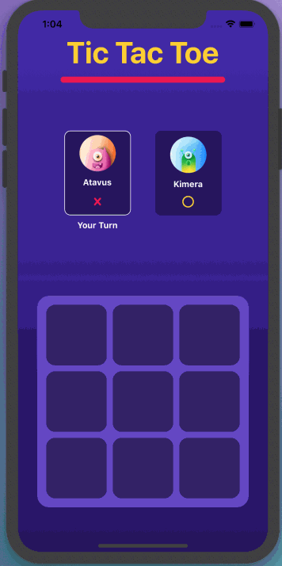
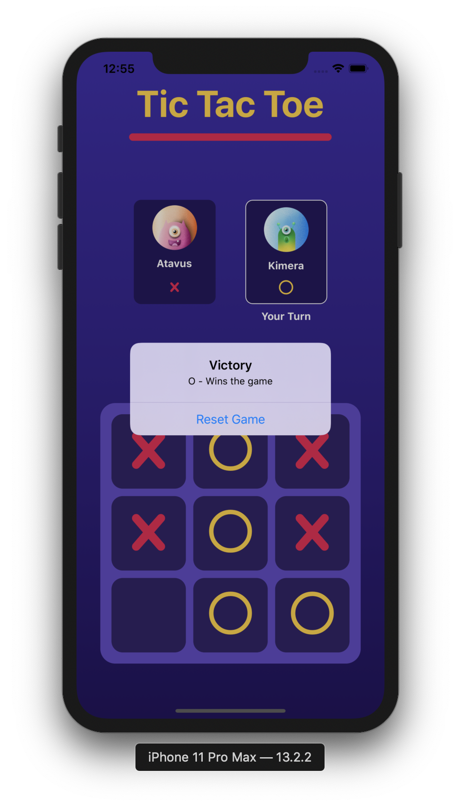
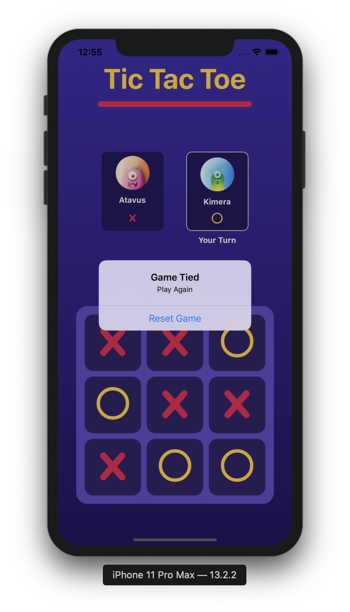

# Tic Tac Toe - X_O

Welcome to Tic Tac Toe mobile application game, built with React Native.

## Table of Contents

- [Tic Tac Toe - X_O](#tic-tac-toe---xo)
  - [Table of Contents](#table-of-contents)
  - [Overview](#overview)
    - [Functionality](#functionality)
  - [Demo](#demo)
  - [Getting Started](#getting-started)
    - [Installation](#installation)
  - [Game](#game)
    - [Project Structure](#project-structure)
    - [Custom components](#custom-components)
    - [Screen & Navigation](#screen--navigation)
  - [Redux](#redux)
    - [State](#state)
    - [Actions](#actions)
    - [Reducer](#reducer)
  - [Algorithms Explanation](#algorithms-explanation)
    - [Update Board](#update-board)
    - [Check Winner / Game Draw](#check-winner--game-draw)
    - [Toggle Player Turn](#toggle-player-turn)
    - [Alert](#alert)
  - [Future Ideas](#future-ideas)
  - [Design Credits](#design-credits)
    - [Feedback](#feedback)

## Overview

This is a Tic Tac Toe mobile application game where 2 players can play at the same time on a 3x3 grid. The app is built in [react native](https://facebook.github.io/react-native/) framework and uses [redux](https://redux.js.org/) for the state management of the game. 

### Functionality

- It allows 2 players to play tic tac toe
- The game have 3x3 grid on which the players can play
- The game screen will give indication on players turn
- Game recognizes when a player has won and declare that player as victorious, or declares a tied game if nobody has won the game.
- It allows the user to start a new game after every game

## Demo


|                     Victory                                    |                            Game Tied                          |                                          
| :-----------------------------------------------------: | :-----------------------------------------------------: | 
|  |  | 

> I have [publised](https://exp.host/@mitulsavani/Tic-Tac-Toe) the application on Expo but unfortunately, Expo does not allow clients to try the app publicly anymore. Therefore, I have provided information below to run the app locally.
## Getting Started 

### Installation
```
git clone https://github.com/mitulsavani/X_O.git
yarn install
yarn run ios 
yarn run android
```

This project was bootstrapped with [ Expo CLI Quickstart ](https://facebook.github.io/react-native/docs/getting-started).

Note: I could have initiated this project using React Native CLI for more flexibility on native side. However, I decided to use Expo CLI because I knew before hand that this application is a comparatively small demo application which would not require much third party libraries.

## Game

### Project Structure 

```
X_O
|__ App.js
|__ package.json
|__ README.md
|__ .eslintrc.json
|__ .gitignore
|__ assests
|   |__ p1.png
|   |__ p2.png
|__ src
     |__ components
     |   |__ Board.js
     |   |__ Button.js
     |   |__ Cell.js
     |   |__ Player.js
     |__ navigation
     |   |__ RootNavigator.js
     |__ redux
     |   |__ actions.js
     |   |__ gameReducer.js
     |   |__ InitialState.js
     |   |__ root.reducer.js
     |   |__ store.js
     |__ screens
     |   |__ GameScreen.js
     |__ styles
         |__ colors.js
         |__ GameScreenStyles.js
         |__ components
             |__ BoardStyles.js
             |__ ButtonStyles.js
             |__ CellStyles.js
             |__ PlayerStyles.js
```

### Custom components

The following components were built to complete the GameScreen:

*  `Board` which renders the grid background
*  `Cell` is called by Board to render 9 squares which finishes our 3x3 grid
*  `Button` is called by Cell to render the value`( X / O / null )`of that cell
*  `Player` to indicate players turn

All custom components have a set of props which I am validating using [Prop-Types](https://github.com/facebook/prop-types).

### Screen & Navigation

The game have one screen called as `GameScreen`. I was intitally thinking to make multiple screens for this game, but I did not see a point in doing it because that would only increase player clicks to reach up to the main `GameScreen` and the navigation was acquired using [react navigation](https://reactnavigation.org/).

## Redux

### State

```jsx
export const InitialState = () => ({
  board: [
    [null, null, null],
    [null, null, null],
    [null, null, null]
  ],
  winner: null,
  currentPlayer: 'X',
  gameOver: false,
});
```

### Actions

* `NEW_GAME` will be dispatched in 2 scenarios; when users open up an application which returns the Initial_State, and when player clicks on the resets game button
of the alert. This alert is rendered when game declares the draw/winner of the game.
* `UPDATE_CELL` will be dispatched when player clicks on one of the 9 cells of the board. This updates the value of that cell.
* `TOGGLE_PLAYER` will be dispatched to alter players turn.
* `CHECK_GAME_OVER` will be dispatched to check whether player have won the game.

```jsx
export const NEW_GAME = 'NEW_GAME';
export const UPDATE_CELL = 'UPDATE_CELL';
export const TOGGLE_PLAYER = 'TOGGLE_PLAYER';
export const CHECK_GAME_OVER = 'CHECK_GAME_OVER';
```

### Reducer

The application has one reducer named as `gameReducer.js` which is responsible to return the updated state.


## Algorithms Explanation

### Update Board

From `GameScreen.js` : <br>
I am fetching the  `rowIndex` and `colIndex` of the cell when player clicks on the cell from the component props and then dispatching `UPDATE_CELL` action with the payload`(rowIndex and colIndex)`. 

From `gameReducer.js` : <br>
I am directly updating the value of that cell on the board with the `currentPlayer`.

```jsx
case UPDATE_CELL:
const { row, col } = action.payload;

state.board[row][col] = state.currentPlayer;

return {
...state,
}
```
### Check Winner / Game Draw

From `gameReducer.js` : <br>

There are in total of 8 ways a player can win this game on 3x3 board. let's look at those patterns: 
```jsx
const winningPatterns = [
  // Horizontals
  [{ r: 0, c: 0 }, { r: 0, c: 1 }, { r: 0, c: 2 }],
  [{ r: 1, c: 0 }, { r: 1, c: 1 }, { r: 1, c: 2 }],
  [{ r: 2, c: 0 }, { r: 2, c: 1 }, { r: 2, c: 2 }],

  // Verticals
  [{ r: 0, c: 0 }, { r: 1, c: 0 }, { r: 2, c: 0 }],
  [{ r: 0, c: 1 }, { r: 1, c: 1 }, { r: 2, c: 1 }],
  [{ r: 0, c: 2 }, { r: 1, c: 2 }, { r: 2, c: 2 }],

  // Diagonals
  [{ r: 0, c: 0 }, { r: 1, c: 1 }, { r: 2, c: 2 }],
  [{ r: 0, c: 2 }, { r: 1, c: 1 }, { r: 2, c: 0 }],
];
```
<br>

The function checks if the  `currentPlayer` value matches with all the three positions of a single combination of the _winningPatterns_. 
```jsx
const checkWinner = (board) => {

  return winningPatterns.some(pattern => pattern.every(cell => {
    const { r, c } = cell;

    return board[r][c] === state.currentPlayer;
  }));
}
```
<br>

The function checks if our current board is full or not.
```jsx
const isBoardFull = (board) => {

  const notFull = board.some(row => row.some(col => col === null));

  return !notFull;
}
```
<br>

The function checks whether a player has won or if the game is draw? By the end of the game, if all cell values are filled up and no player value have matched with one of the _winningPatters_ then the game will be considered as draw.

**Note:** I am aware that the function returns three different kind of values `(string, null, booleans)`. I believe that this is considered as bad practice, therefore I would definitely optimize this later. 

```jsx
const checkGameOver = (board) => {
  if(checkWinner(board)) {
    return state.currentPlayer;
  }
  if(isBoardFull(board)) {
    return null;
  }
  return false;
}
```

### Toggle Player Turn

From `gameReducer.js`: <br>

I am doing 2 things here; Firstly, checking if winner is already declared, if so then there is no point in altering player because game is over! Ortherwise, I would alter the player.
```jsx
case TOGGLE_PLAYER:
if(state.winner !== null) 
  return state;

const nextPlayer = state.currentPlayer === 'X' ? 'O' : 'X';

return {
  ...state,
  currentPlayer: nextPlayer,
}
```

### Alert 

From `GameScreen.js`: <br>

I am rendering alert based on `winner` and `gameOver` entity from the state. If _gameReducer.js_ have found out a winner then pop Victory alert, otherwise render Game-Tied alert. 

```jsx
displayGameStatusAlert = () => {
  const { game } = this.props;
  const { winner, gameOver } = game;

  if(gameOver === true) {
    if(winner !== null) {
      return(
        Alert.alert(
          'Victory',
          `${winner} - Wins the game`,
          [{ text: 'Reset Game', onPress: () => this.resetGame()}],
          { cancelable: false }
        )
      )
    } else {
      return(
        Alert.alert(
          'Game Tied',
          'Play Again',
          [{ text: 'Reset Game', onPress: () => this.resetGame()}],
          { cancelable: false }
        )
      )
    }
  } 
}
```
<br>

When player presses the alert button, I am calling a `resetGame()`  function which re-renders the game with the Initial_State.
```jsx
resetGame() {
  this.props.newGame();
}
```

## Future Ideas

* I am thinking to implement a algorithm by which a Player can play the game with CPU bot. What this means from technical side is after players' input, I will
dispatch an action which will randomly select one `null` postition from the board and assign a value( X / O) to it. I found an interesting [article](https://towardsdatascience.com/tic-tac-toe-creating-unbeatable-ai-with-minimax-algorithm-8af9e52c1e7d) which might possibly help me achieve this feature.

* As of now my app is dispatching three actions asynchronously in  one function `handleClick()`, this works completely fine, but this is also considered as a bad practice in my case. At some point of time I want to avoid this and dispatch the actions synchronously using `middleware`.

```jsx
handleClick(rowIndex, colIndex) {
  
  this.props.updateCell(rowIndex, colIndex);
  this.props.checkGameOver();
  this.props.togglePlayer();
}
```

## Design Credits

* I was inspired by Shashank Kumar's _tic-tac-toe_ prototype design from their dribbble [page](https://dribbble.com/shots/6187597-Tic-Tac-Toe#shot-description).
* Player avatar are coming from Prakhar Neel Sharma dribbble [page](https://dribbble.com/shots/8623352-User-avatar-part-2/attachments/881594?mode=media).

### Feedback

In case if you have any questions or feedback about this application, feel free to reach out to me [**@mitulsavani**](https://github.com/mitulsavani)
> created by Mitul Savani, updated on 01/14/2020
